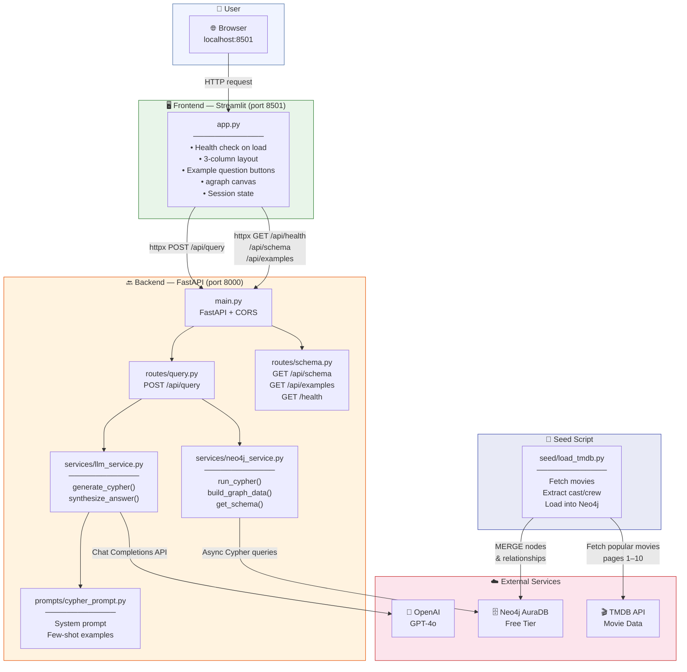
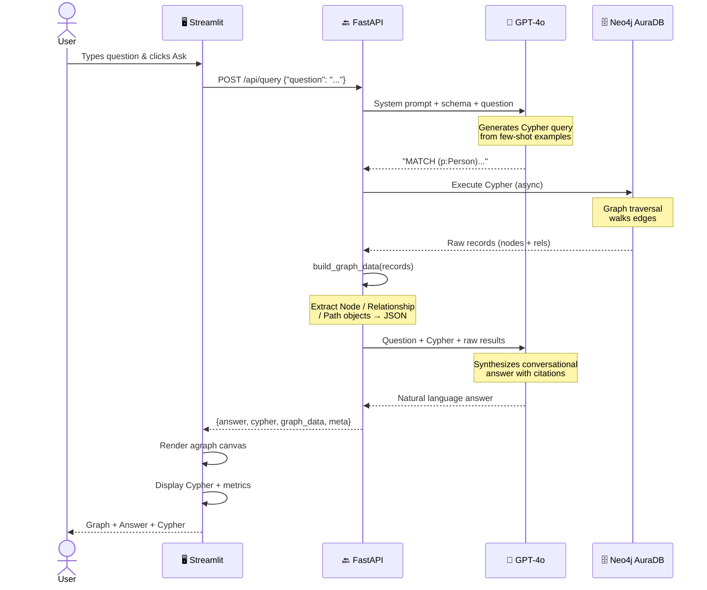
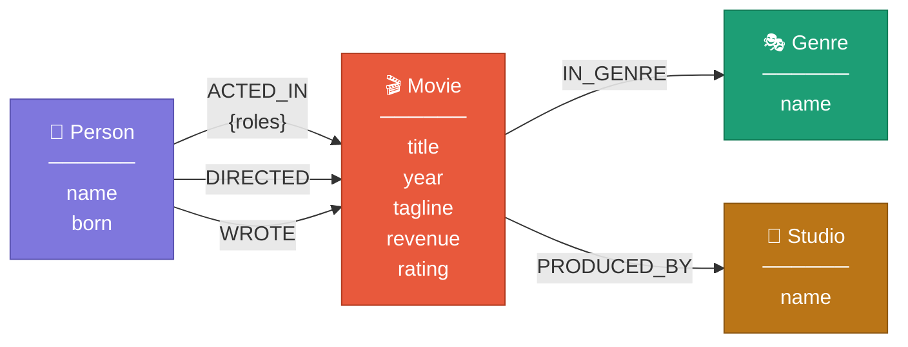
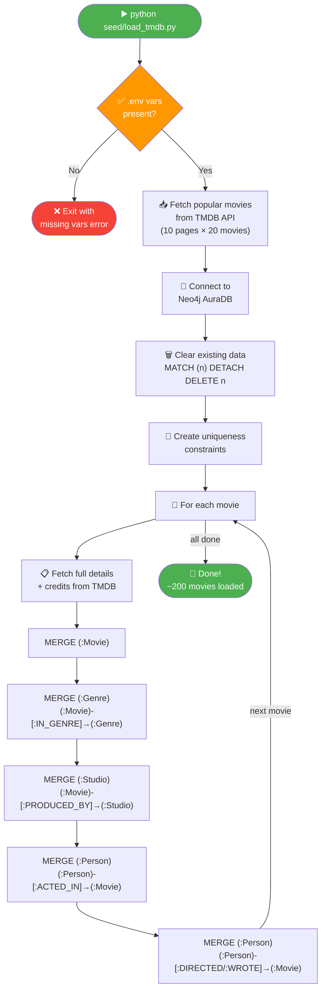
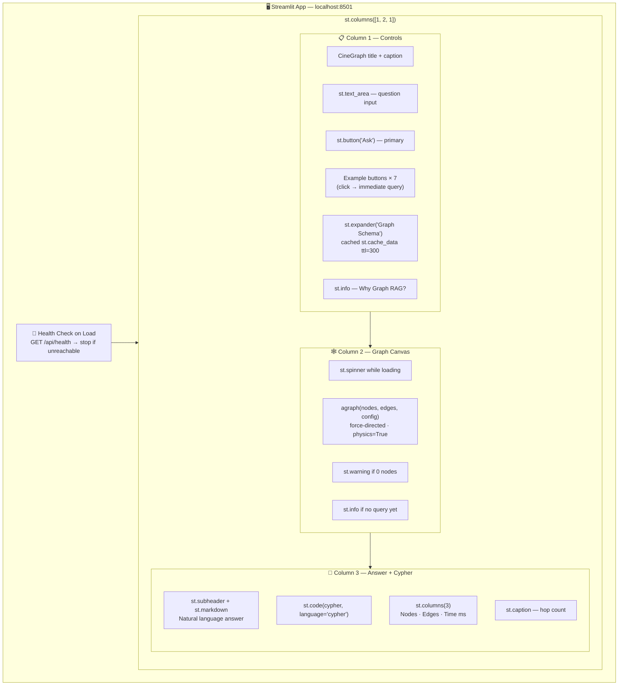

# 🎬 CineGraph — Architecture Diagrams

---

## 1. System Architecture

---

## 2. Request Flow — POST /api/query

---

## 3. Neo4j Graph Schema

---

## 4. Data Seeding Flow

---

## 5. Frontend Layout

